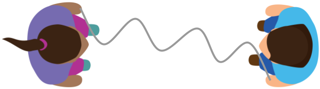

# Encoding Unplugged

This activity focuses on the problem of transmitting bits of information from one device to another using electromagnetic waves. Through this activity, students "discover" a variety of wired and wireless encoding techniques. 

**Activity Duration:** ~20 minutes

**Group size:** 2+ students

**Materials required:** ~3 piece of rope for each group

**Student background knowledge:** Before completing this activity, students should know that information is represented using bits and transmitted over cables or free space using electricity, light, or radio waves; [this video](https://www.youtube.com/watch?v=ZhEf7e4kopM) provides a good introduction to these topics.

## Introduce the activity to students
The goal of this activity is to explore different ways of encoding bits of information for transmission over a cable or free-space.

Each group will receive a piece of rope, which represents an electromagnetic wave. One person, representing the receiver, will hold on to one end of the rope. Another person, representing the sender, will hold on to the other end of the rope and manipulate the rope to encode a short sequence of bits. 

💡 **Tip:** Keeping the rope on the floor will make it easier to "transmit" and "recieve" the desired sequence. 

## Students complete the activity
Each group should complete [this worksheet](encoding_worksheet.md) during the activity.

💡 **Tip:** For a shorter activity, exclude questions 7 and/or 8-12 from the worksheet.

## Discuss students' ideas and observations
Ask groups to share their ideas and observations with the class. 

Students' ideas, and their networking equivalents, typically include: 

* keeping the rope still to transmit a 0 and moving the rope to transmit a 1 ≈ _[non-return to zero (NRZ)](https://en.wikipedia.org/wiki/Non-return-to-zero)_
* moving the rope side-to-side slowly for a 0 and quickly for a 1 ≈ _[frequency shift keying (FSK)](https://en.wikipedia.org/wiki/Frequency-shift_keying)_
* moving the rope side-to-side slightly for a 0 and significantly for a 1 ≈ _[amplitude shift keying (ASK)](https://en.wikipedia.org/wiki/Amplitude-shift_keying)_
* moving the rope to the left for a 0 and to the right for a 1 ≈ _[phase shift keying (PSK)](https://en.wikipedia.org/wiki/Phase-shift_keying)_

⚠️ **Note:** Another common idea is to have the rope slack for a 0 and tug on the rope for a 1. However, electromagnetic waves cannot be manipulated in this manner.