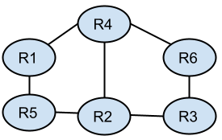

# Intra-domain Routing Unplugged
This activity focuses on the problem of determining the sequence of routers or switches a packet should traverse to reach its destination. Through this activity, students "discover" a variety of intra-domain routing algorithms.

**Activity Duration:** ~20 minutes

**Group size:** 6+ students

💡 **Tip:** Adjust the topology for larger/smaller groups.

**Materials required:** small pieces of paper for exchanging information; ["connectivity" worksheet](intra-domain_routing_worksheet.md) for each group member

**Student background knowledge:** Students should be introduced to packet-switching before completing this activity.

## Introduce the activity to students
During this activity, each student will play the role of a network router. Each student will be "connected" one or more neighboring routers (i.e., group members). The ["connectivity" worksheet](intra-domain_routing_worksheet.md) each student receives will specify their router identifier and the identifiers of their neighboring routers.

⚠️ **Note:** Only the facilitator(s) should know the complete the network topology (shown below); do not share this information with students until after they complete the activity.



💡 **Tip:** Adjust the network topology and ["connectivity" worksheet](intra-domain_routing_worksheet.md) to accommodate larger/different topologies.

Your goal is to be able to forward packets from one router to another until a packet reaches its intended destination. A packet will be represented by a piece of paper, which includes: 
* the source router's id
* the destination router's id
* a secret message

For example: 
```
Src = 1, Dst = 3, Secret = Networking is awesome!
```

💡 **Tip:** To make the activity more challenging for students, have each router also "connect" to one or more "hosts." Packets should have source and destination host identifiers instead of router identifiers.  Each router (i.e., student) is responsible for packets to/from its connected hosts. 

Students may use their voice to talk with their group members about:
* The instructions for the activity
* Ideas for how to solve the problem
* How well the approach worked

Students must use pieces of paper to:
* Forward a packet to another router
* Share the ids of their neighboring routers or the contents of packets they have received
* Share information they learned from neighboring routers
Students may only pass pieces of paper to their neighboring routers.

## Students complete the activity
Each group completes the following steps:
1. Discuss (with your voices) how each router should behave to ensure packets reach their destination. During the discussion, **do not share any information that can only be shared via pieces of paper**.

2. Everyone should behave as you agreed upon. You should only use your voice to clarify the instructions and how you should behave. **All other information must be sent via pieces of paper.**

3. When the group is ready to forward packets (you can use your voices to check if everyone is ready), the person whose first name comes first in the alphabet should create a packet with:
    * Their router id as the source 
    * A destination router id of their choosing – choose a router that is not one of your neighbors
    * A secret message of their choosing
    
    **The packet and all other information must be sent via pieces of paper.** You should only use your voice to clarify the instructions and how you should behave. The destination router should verbally announce when they receive the packet.

4. Discuss (with your voices) whether your approach worked. If not, what went wrong? How would you change your behavior? If time allows, try your modified approach.

💡 **Tip:** The facilitator(s) should have some packets they can give to groups to "stress test" a group's approach and encourage discussion. For example: a packet originating from router 1 destined for router 3 requires traversing the full network diameter and also has the potential to get stuck in a "loop" between routers 1, 4, 2, and 5.

## Discuss students' ideas and observations
Share the complete network topology with the class. Ask groups to share their ideas and observations with the class. 

Students' ideas, and their networking equivalents, typically include: 

* a person adds their number to a message before passing it along to one of the individuals to whom they can pass messages and whose number is not yet listed in the message ≈ [self-avoiding random walk](https://en.wikipedia.org/wiki/Self-avoiding_walk#On_networks)
* a person passes along a message to all individuals to whom they can pass messages, duplicating the message as needed ≈ [flooding](https://en.wikipedia.org/wiki/Flooding_(computer_networking))
* a person creates a message with a list of individuals to whom they can pass messages, and gives a copy of this to each of these individuals; when a person receives such a message, they write down this information in their notebook and pass the message to all individuals to whom they can pass messages, duplicating the message as necessary; when a person receives a "real" message, they use the information written in their notebook to determine whom to pass the message to ≈ [link state routing](https://en.wikipedia.org/wiki/Link-state_routing_protocol)

⚠️ **Note:**  Students are often not creative enough to "discover" learning switches or [distance vector routing](https://en.wikipedia.org/wiki/Distance-vector_routing_protocol), but these can be discussed after students have come up with their own ideas.