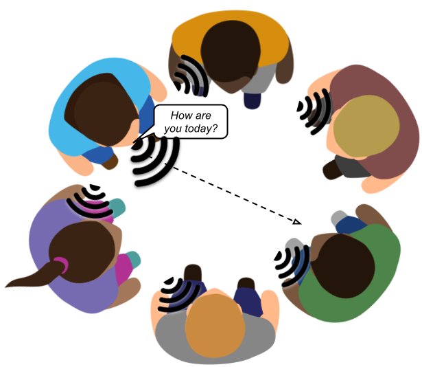

# Encoding Unplugged

This activity focuses on the problem of multiple senders and receivers communicating over the same cable or free space. Through this activity, students "discover" a variety of multiplexing and access control techniques for wired and wireless networks.

**Activity Duration:** ~10 minutes

**Group size:** 6+ students

**Materials required:** None

**Student background knowledge:** Students should be introduced to circuit- and packet-switching before completing this activity.

## Introduce the activity to students
The goal of this activity is to answer the question: _how can multiple parties communicate over a shared medium?_

In this activity, a group of people is trying to communicate using sound. The air is the shared transmission medium.

Within each group, form 3 pairs (or more if the group is larger). One person in each pair should choose a question they want to ask; the other person will respond after they hear the question.

💡 **Tip:** Group members should be seated or standing in a circle, and each person should be paired with the person across from them.

The only way people can communicate is using sound! Come up with a scheme that allows every pair to successfully ask their question and respond.

## Students complete the activity
💡 **Tip:** Students often don't consider the possibility that two people may start talking at the same time. The facilitator can force students to consider this scenario by loudly talking over a student as soon as they start asking a question.

## Discuss students' ideas and observations
Ask groups to share their ideas and observations with the class.

Students' ideas, and their networking equivalents, typically include: 

* take turns in a circle ≈ [time division multiplexing (TDM)](https://en.wikipedia.org/wiki/Time-division_multiplexing)
* establish an order of speakers before starting to communicate ≈ scheduling (in cellular networks)
* use different pitches or types of sound (e.g., talking, clapping, tapping) ≈ [frequency division multiplexing (FDM)](https://en.wikipedia.org/wiki/Frequency-division_multiplexing)
* start talking if no one else is talking; if two people start talking at the same time, both people stop talking and wait before trying again ≈ [carrier sense multiple access with collision detection (CSMA/CD)](https://en.wikipedia.org/wiki/Carrier-sense_multiple_access_with_collision_detection)

💡 **Tip:** To get students to think more critically about TDM, the facilitator can ask: (1) what happens if it is someone's turn and they have nothing to say? (2) what happens if someone asks a really long question or provides a really long response?

💡 **Tip:** To get students to think more critically about how well the techniques scale, the facilitator can ask: what happens if there are many pairs of students that want to communicate (e.g., the entire class is a single group)?

Ideas that violate the restriction of only using sound but adhere to the problem in principle include:

* raise your hand and wait to be called on ≈ [request-to-send/clear-to-send (RTS/CTS)](https://en.wikipedia.org/wiki/IEEE_802.11_RTS/CTS)
* pass an object around the circle; a person can only talk when they are holding the object ≈ [token passing](https://en.wikipedia.org/wiki/Token_passing)